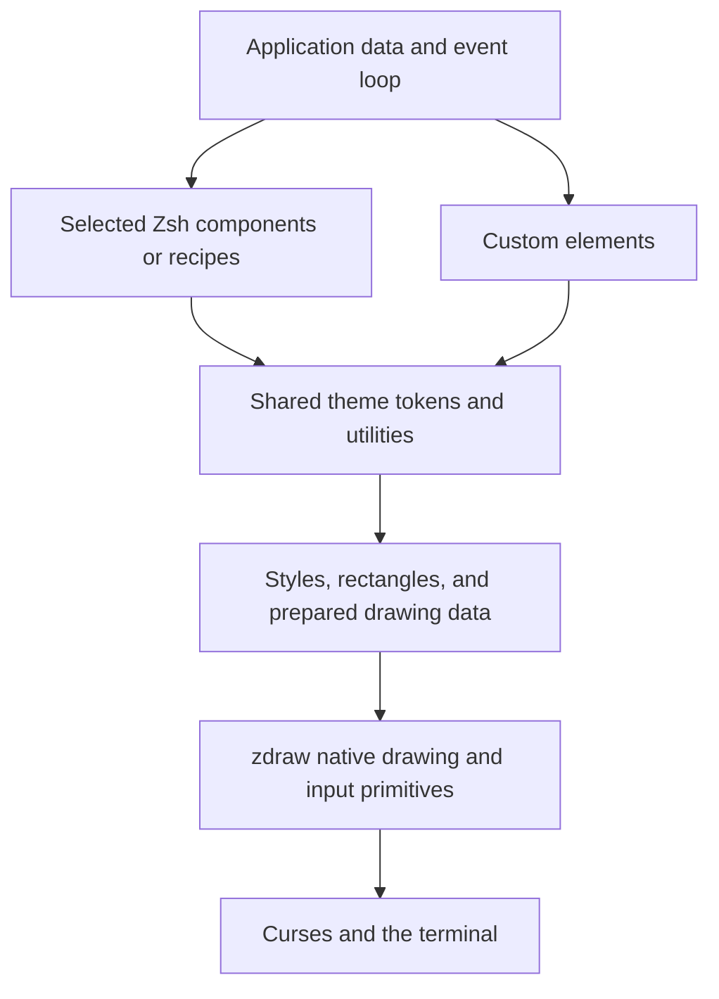

# Making beautiful TUIs easier with zdraw

**Scope update 2026-09-11:** this report is historical research. The
[project stop line](scope.md) supersedes its expansion proposals. Image work was
rejected and removed; scaled text is cancelled. References below do not imply
current support or an implementation commitment.

**The strongest opportunity is a small, optional Zsh design toolkit built on zdraw's existing drawing primitives, with a Tailwind-inspired model of composition and customization.** Developers select the elements they need and adjust colors, borders, spacing, and states through shared utilities and theme tokens. Good defaults make the first interface attractive; individual overrides make it their own.

The most useful references are Lip Gloss for composition, Textual for themes and visual development, Ratatui for rectangular layout, Posting for application polish, and btop for dense graphical information. Their value comes from different strengths; adopting one framework's entire architecture would lose that distinction.

This report separates documented capabilities from design judgments and proposed work. The recommendations concern developer experience and visual quality. They do not constitute an implementation commitment or reopen every item in the technical roadmap.

**Implementation follow-up:** the first bounded trial is now available as
[optional Zsh UI libraries](ui-toolkit.md), with a working panel/list gallery and
an implementation checklist. The conceptual notation and broader proposals below
remain research; the toolkit guide documents the actual API and current scope.

## A Tailwind-inspired model for zdraw

Tailwind provides small styling utilities backed by configurable theme variables, with variants for interaction states and responsive conditions. Those are useful foundations for zdraw's developer experience. Ready-made, individually customizable elements add a component layer above those utilities; shadcn/ui is a relevant companion reference because it emphasizes composable components, editable source, and carefully chosen defaults. [Tailwind theme variables](https://tailwindcss.com/docs/theme), [Tailwind state variants](https://tailwindcss.com/docs/hover-focus-and-other-states), [shadcn/ui introduction](https://ui.shadcn.com/docs).

The proposed toolkit would have four independently useful layers:

| Layer | What it supplies | What a developer can customize |
| --- | --- | --- |
| Tokens | Named colors, spacing choices, border sets, and density values | Change an accent or border family across an application. |
| Utilities | Foreground/background, emphasis, padding, alignment, border treatment, and geometry helpers | Compose a custom element without adopting a standard component. |
| Components | Panels, labels, badges, lists, tables, tabs, status rows, and later inputs | Select elements individually and override appearance or named parts. |
| Recipes | Small compositions such as list/detail or a dashboard | Copy, adapt, or replace the layout and application behavior. |

For example, the following is **conceptual design notation, not an implemented API**:

```text
element: panel
utilities: bg-surface text-default border-rounded border-muted px-2 py-1
state: focus:border-accent

element: list
item: text-default px-1
item.selected: bg-selection text-on-selection
item.selected-unfocused: bg-selection-inactive text-default

application overrides:
  accent = teal
  panel border = double
  list item horizontal padding = 2 columns
```

The essential promise is that changing a panel's border or a list's selection color does not require rewriting its rendering or event handling. A developer should be able to theme the whole application, define a reusable component variant, or customize one instance. Named parts such as a table's header, selected row, separator, and empty state make local customization precise.

A class-like syntax may be pleasant, but the underlying model should be structured, validated properties. Zsh argument arrays or named definitions can carry the same choices. Whether the public spelling uses short utility tokens, explicit options, or both should be decided with a small usability experiment. Avoid evaluating strings or reparsing long style expressions for every cell.

Conflicting choices need documented resolution. Tailwind itself warns that conflicting classes are resolved by stylesheet order, not simply their order in an HTML attribute. zdraw should define its own clear precedence between component defaults, reusable variants, and instance overrides, plus rules for combined states. It should not accidentally imply CSS compatibility. [Tailwind utility conflicts](https://tailwindcss.com/docs/styling-with-utility-classes#conflicting-utility-classes).

Responsive variants also need terminal semantics. Tailwind's responsive utilities are a useful model, but zdraw should express thresholds in rows and columns and support the size of an allocated pane. Hiding a secondary panel can be a recipe-level decision; a styling utility cannot decide which application task to preserve. [Tailwind responsive design](https://tailwindcss.com/docs/responsive-design).

Each selected component should load only its documented dependencies. In this proposal, a component module is a companion Zsh library, not a separate native module. Loading styling helpers should neither initialize curses nor enable terminal protocols. An application can adopt one helper or the entire collection while keeping its event loop and data model.

## The strongest references

| Reference | What deserves attention | Implication for zdraw |
| --- | --- | --- |
| [Lip Gloss](https://github.com/charmbracelet/lipgloss) | Declarative styling and composition, spacing, alignment, borders, and color profiles | Make small pieces easy to combine and restyle. |
| [Textual themes](https://textual.textualize.io/guide/design/) | Semantic colors and styles for focused, unfocused, selected, and disabled states | Define a visual vocabulary that components share. |
| [Ratatui layout](https://ratatui.rs/concepts/layout/) | Nested rectangles, fixed and flexible sizes, and alignment | Remove repetitive coordinate arithmetic from application code. |
| [Posting](https://posting.sh/guide/) | Standard/compact spacing and an integrated keyboard workflow | Treat density and navigation as designed features. |
| [btop](https://github.com/aristocratos/btop) | Graphs, compact meters, numeric readouts, and persistent regions | Put visual emphasis on information, with deliberate fallbacks. |
| [Rich tables](https://rich.readthedocs.io/en/stable/tables.html) | Column sizing, wrapping, alignment, optional borders, and padding | Tables should accept data and layout choices rather than preformatted strings. |
| [Bubbles](https://github.com/charmbracelet/bubbles) | Components with behavior: lists, input, viewports, progress, and help | Reuse complete interactions as well as their appearance. |
| [Gum](https://github.com/charmbracelet/gum) | Small shell-facing utilities with useful defaults | Make the first successful interface short and understandable. |
| [Huh](https://github.com/charmbracelet/huh) | Forms, validation, themes, and an alternative accessible prompt mode | Let appearance and interaction mode vary independently. |
| [Yazi flavors](https://yazi-rs.github.io/docs/flavors/overview/) | A distributable theme package with separate user overrides | Make customization survive theme updates. |

These are selections for this project's needs, not an objective ranking of frameworks. The frameworks target different languages and rendering models. Their existence demonstrates feasible patterns, not measured improvements in usability or evidence that a Zsh implementation would have equivalent performance.

## What the visual examples reveal

### Posting: an interface with a clear visual hierarchy

The [published application preview](https://posting.sh/) puts the request address across the top, the collection at the left, and request/response content in a larger work area. Thin borders, active tab underlines, selected rows, and a compact shortcut footer make different levels of interaction visible. A response status is presented as a short, conspicuous label rather than requiring the reader to inspect the body.

The useful lesson is how consistently these treatments work together. The application has many controls, but related content shares a region and the strongest accents have identifiable jobs. This is a visual assessment of the published preview, not a finding from task-based user testing.

Posting also explicitly supports `standard` and `compact` spacing; compact removes padding and borders. That is a strong precedent for making density a coherent setting instead of asking users to tune dozens of unrelated dimensions. [Posting getting started](https://posting.sh/guide/).

### Lip Gloss: small visual pieces compose into a complete screen

The [official example image](https://github.com/user-attachments/assets/92560e60-d70e-4ce0-b39e-a60bb933356b) combines tabs, a centered dialog, lists, columns of wrapped text, and a status strip. Consistent alignment and spacing connect the pieces. It also demonstrates a useful distinction: a showcase can display many effects without making all those effects appropriate defaults for a working application.

Lip Gloss provides declarative styling and supports ANSI, indexed, and RGB colors. Its current v2 documentation also makes terminal queries explicit in its recommended color-handling approach, warning that hidden I/O can compete for input. Both composition and explicit ownership are relevant to zdraw. [Lip Gloss README](https://github.com/charmbracelet/lipgloss/blob/main/README.md).

### btop: density can be beautiful

The [official main-screen image](https://raw.githubusercontent.com/aristocratos/btop/main/Img/normal.png) demonstrates a different aesthetic: tightly packed regions, line graphs, meters, and aligned numbers. The charts are accompanied by current values and units. Borders carry labels and actions, so some of the structural decoration also does informational work.

The transferable idea is a disciplined relationship between visual summaries and exact values. Its faded lower process rows are an example to evaluate carefully: attractive hierarchy can also make information harder to read. Copying a screenshot's colors is not sufficient justification for a default theme.

btop provides separate low-color and TTY options; its manual describes TTY mode as using ANSI graph symbols and 16 colors. A zdraw chart should likewise offer a useful reduced-capability representation. [btop manual](https://github.com/aristocratos/btop/blob/main/manpage.md).

The earlier [zdraw btop review](btop-review.md) already identified configurable borders, semantic colors, and caching. Several underlying primitives have since been implemented. The next opportunity is to package those capabilities into a coherent developer-facing experience.

## A design language for terminal applications

### Theme roles and component states

Textual themes start from a small set of base colors and expose derived variables for surfaces, text, borders, input, cursors, and other widgets. It distinguishes focused and blurred cursor styles. Catppuccin's style guide independently assigns colors to semantic functions such as body text, labels, warnings, selections, and active borders. [Textual themes](https://textual.textualize.io/guide/design/), [Catppuccin style guide](https://github.com/catppuccin/catppuccin/blob/main/docs/style-guide.md).

For zdraw, a useful initial vocabulary would be:

| Role group | Suggested roles | Purpose |
| --- | --- | --- |
| Surfaces | canvas, surface, elevated surface | Distinguish large areas and temporary overlays. |
| Text | text, secondary text, disabled text | Establish hierarchy without making normal content faint. |
| Structure | separator, border, focus border | Explain grouping and current input ownership. |
| Interaction | selection, inactive selection, match, cursor | Distinguish where input goes from what is selected or found. |
| Meaning | accent, success, warning, error | Keep status meanings stable across components. |

These are proposed roles, not new builtin arguments. A role should resolve to a complete style, including foreground, background, and attributes where appropriate. Naming a foreground alone leaves selected text unreadable when the background changes.

The state model matters as much as the palette. A selected row in an unfocused list should remain recognizable without looking like the current keyboard target. A search match inside a selected row needs a deliberate combined style. An invalid field may also be focused. Start with explicit combinations for the initial components rather than a general-purpose cascading selector system.

Theme changes also have a real zdraw cost: prepared rows retain resolved color pairs. They must be rebuilt or invalidated when their theme-dependent appearance changes. Releasing a row must not be assumed to reclaim color pairs, and endlessly generating new palettes can exhaust the session's allocation budget. A theme preview should use a bounded palette set and report capacity through existing color information. [zdraw prepared-row and color design](design.md).

### Three coordinated visual presets

I recommend three presets that vary more than hue:

| Proposed preset | Character | Typical choices |
| --- | --- | --- |
| Quiet | Reading, forms, focused work | Limited accent use, clear headings, selective borders, comfortable horizontal padding. |
| Dense | Frequent navigation and operational work | Single-row controls, shared separators, compact metadata, persistent status and help. |
| Dashboard | Monitoring and numerical exploration | Small multiples, meters, sparklines, stable numeric columns, a consistent chart palette. |

All three should work in light, dark, and terminal-default color configurations. Density should remain independently selectable: a light interface can be dense, and a dashboard can be spacious. The presets would demonstrate good combinations while allowing applications to replace every decision.

Yazi offers a useful packaging model: a flavor is a reusable theme, while user preferences override it without modifying the distributed files. Its documentation currently labels flavors beta. For zdraw, adopt the separation of defaults and overrides without copying its file format or assuming its maturity guarantees. [Yazi flavors](https://yazi-rs.github.io/docs/flavors/overview/).

### Typography through spacing and alignment

For the portable baseline, treat the terminal as a cell grid whose font and base size are chosen by its user. Establish hierarchy with alignment, wording, emphasis, line length, indentation, and space. A short heading with breathing room often needs less decoration than an elaborate enclosing box.

Recommended defaults to explore are zero or one row of vertical separation, one or two columns of horizontal padding, left-aligned labels, and right-aligned numbers with consistent units. These are starting design choices, not universal rules. Vertical padding is particularly expensive on a 24-row screen.

Rich is a useful reference because its tables expose column alignment, automatic sizing, wrapping, padding, and optional grids separately. Its grid layout can position content without visible table borders. That separation makes appearance easier to vary without rewriting the data formatting. [Rich tables](https://rich.readthedocs.io/en/stable/tables.html).

The terminal should retain sensible typography when icons are absent. Nerd Fonts explicitly supplies patched fonts and extra glyph collections; those glyphs therefore should be an optional enhancement, not required labels. Essential controls need words or ordinary ASCII alternatives. [Nerd Fonts](https://www.nerdfonts.com/).

## Layout that survives real terminals

Textual's layout guidance recommends starting with a sketch, working inward from fixed outer regions, using flexible units, and grouping scrolling content into containers. Ratatui expresses layout through nested rectangles and constraints including lengths, limits, proportions, and flexible allocation. These are complementary references for a small Zsh geometry library. [Textual layout design](https://textual.textualize.io/how-to/design-a-layout/), [Ratatui layout](https://ratatui.rs/concepts/layout/).

The first layout helpers should calculate rectangles without reading terminal input or drawing. Useful operations are horizontal and vertical splits, inset/padding, alignment, fixed-size allocation, and weighted division of remaining space. The result should be inspectable data that callers can use with ordinary windows, pads, or direct drawing.

A small system needs exact behavior for shortages. Decide which regions may shrink, disappear, scroll, or replace one another. Define how leftover cells are assigned. A deterministic rule such as assigning division remainders in declaration order is easier to understand and test than an underspecified approximation of a constraint solver.

Responsive design needs application decisions as well as geometry. A helper cannot know whether a preview or a results list is more important. Provide recipes that make this decision explicit:

| Available space | Example behavior for a list/detail application |
| --- | --- |
| Wide | List and detail side by side; metadata stays visible. |
| Medium | Narrower list; secondary metadata hides first. |
| Narrow | One active view with a visible way to switch or return. |
| Extremely small | A short explanation and working quit/back controls. |

Choose thresholds from content minima, not conventional web breakpoints. A long translated label or a wide-character filename can change the useful threshold. Test heights as well as widths: many terminal applications occupy a short multiplexer pane.

An illustrative composition, not a proposed application or executable API:

```text
Wide
Workspace                                 Ready
------------------------------------------------
Items               | Details
> Selected item     | Title
  Another item      |
  Third item        | Relevant information
                    | and a useful next action.
------------------------------------------------
Tab switch   Enter open   / filter   ? help

Narrow
Items                         3 results
---------------------------------------
> Selected item
  Another item
  Third item
---------------------------------------
Enter details   / filter   ? help
```

The defining property is preserving the task while changing the arrangement. Merely clipping the wide version would remove essential information and actions.

## Components that look and behave finished

Bubbles offers useful evidence for the value of complete components: its list combines filtering, pagination, help, activity, and status; its inputs and viewports handle scrolling. Gum exposes common interactions to shell scripts with small commands. These establish two useful targets: complete behavior and a low barrier to first use. [Bubbles](https://github.com/charmbracelet/bubbles), [Gum](https://github.com/charmbracelet/gum).

The proposed initial set should stay small:

| Component | Visual details worth standardizing | Behavior that completes it |
| --- | --- | --- |
| Panel | Title clipping, padding, optional border, shared dividers | Correct tiny-size behavior and focus indication. |
| List | Selection marker, secondary text, match emphasis, empty state | Stable selection, scrolling, and clear activation. |
| Table | Alignment, restrained separators, overflow indicators | Stable columns, visible sort state, selected-row identity. |
| Tabs | Active/inactive distinction and consistent baseline | Hidden-tab indication and predictable keyboard movement. |
| Status/help row | Key labels, status roles, prioritization | Drop less useful hints first when space is scarce. |
| Progress/meter | Aligned label, value, units, optional graph | Distinguish progress, unknown duration, failure, and completion. |

An input field and form system would be valuable follow-ups, but robust editing includes selection, paste, validation, cursor movement, and Unicode boundaries. It deserves its own bounded proposal rather than being hidden inside a visual cleanup.

Each component should be demonstrable with no data, one item, overflowing content, a long label, focus elsewhere, an error, and a narrow rectangle. Those states are part of its design contract. A good-looking default screenshot does not establish that the component is finished.

Component appearance can be reusable while keymaps remain configurable. Posting's navigation documents tab movement, jump overlays, mouse navigation, and focused-widget help. The lesson for zdraw is discoverability: show a small number of relevant actions, with an obvious route to the rest. Jump labels are a promising later recipe, not a reason to put command routing in the C module. [Posting navigation](https://posting.sh/guide/navigation/).

Harlequin offers another useful escape from density: its documentation advertises expanding the editor or results to full screen. That is a generally reusable interaction for a multipane application. [Harlequin](https://harlequin.sh/).

fzf demonstrates a different advantage: a useful interaction can occupy only part of the terminal and preserve visible command context above it. Its height and popup modes are inspiration for a future shell interaction experiment. zdraw's current full-screen lifecycle should not be mistaken for an already implemented inline equivalent. [fzf advanced examples](https://github.com/junegunn/fzf/blob/master/ADVANCED.md).

## A gallery that also works as a design workshop

**This is the highest-value experiment I recommend.** Build a standalone gallery from the same public components applications would import. It should make good design visible and make awkward states easy to reproduce.

Textual's development mode updates CSS while an application runs. Posting supports live previews when editing theme files. These provide a concrete precedent for shortening the edit/view cycle. [Textual devtools](https://textual.textualize.io/guide/devtools/), [Posting themes](https://posting.sh/guide/themes/).

A first zdraw gallery could expose these controls:

| Control | What a developer learns |
| --- | --- |
| Theme | Whether roles remain coherent across components. |
| Density | Whether spacing is intentional and still usable. |
| Width and height | Which content disappears and whether actions survive. |
| Component state | How normal, focused, selected, disabled, and error states relate. |
| Content fixture | Whether long text, empty data, CJK, and combining marks break the view. |
| Color/glyph profile | Whether a reduced-capability rendering still communicates the same information. |
| Geometry overlay | Which rectangle, inset, or clipping boundary explains an alignment error. |

Simulated profiles should be labeled as simulations. A gallery rendered in one terminal cannot prove another terminal's font coverage, color behavior, or Unicode layout.

The gallery should include a few complete recipes alongside individual components: list/detail, a data table with an inspector, and a task monitor. Each recipe should link to concise source and explain its spacing, focus, and overflow decisions. Small examples remain useful for learning primitives; these recipes demonstrate how to choose among them.

Theme loading must preserve input ownership. Explicit light/dark/default selection is sufficient for a first version; silent terminal background probing inside a style helper is inappropriate. Invalid theme edits should leave the previous usable theme active. Treat exported theme data as bounded data, not arbitrary shell code to evaluate.

The workshop can start with a reload key. Automatic file watching, a browser editor, theme sharing, and an elaborate inspector are optional extensions that need evidence from use. A small working iteration loop is enough to test the idea.

## Visual quality across capabilities and preferences

### Color, contrast, and focus

Use a readable default palette and check actual foreground/background combinations, including selection, warnings, and secondary text. WCAG's 4.5:1 minimum contrast criterion for ordinary text is a useful design target where both RGB colors are known. It is a web standard used here as a reference, not a claim that applying a ratio certifies a terminal application as accessible. [W3C contrast guidance](https://www.w3.org/WAI/WCAG22/Understanding/contrast-minimum.html).

Terminal-default colors and user-redefined indexed palettes may not have known RGB values. Report contrast as unknown in those cases rather than inventing a passing score. Test dark and light backgrounds separately. Color quantization can merge distinctions that looked clear in RGB, so an indexed fallback needs visual review as well as a conversion algorithm.

Color should reinforce meaning. Use a label, marker, underline, or other available distinction for errors, selections, and focus. The interface should still communicate which control receives input when hue differences disappear. This recommendation follows the principles in W3C's use-of-color and visible-focus guidance. [Use of color](https://www.w3.org/WAI/WCAG22/Understanding/use-of-color.html), [Focus visible](https://www.w3.org/WAI/WCAG22/Understanding/focus-visible.html).

Honor a nonempty `NO_COLOR` as a default preference in the companion toolkit, with explicit user configuration allowed to override it. The convention concerns color, not the removal of bold or underline. This policy belongs where defaults are chosen; it should not silently change the inherited behavior of explicit drawing operations in the C module. [NO_COLOR specification](https://no-color.org/).

Screen-reader usability needs separate attention. Huh offers an accessible mode that replaces its TUI forms with ordinary prompts. A zdraw application could similarly offer a linear prompt or plain-output path where its task permits it. Monochrome styling alone does not establish compatibility with assistive technology; actual testing with terminal/screen-reader combinations remains necessary. [Huh accessibility](https://github.com/charmbracelet/huh#accessibility).

### Unicode and icons

The existing zdraw text APIs provide system-width-based measurement and complete clipping units, not general grapheme segmentation or a guarantee of terminal shaping. Unicode's own East Asian Width report cautions that the property is not an off-the-shelf solution for modern terminal emulators. [zdraw text contract](../README.md#cell-aware-clipping), [Unicode UAX #11](https://www.unicode.org/reports/tr11/).

Consequently, the toolkit should use one measurement policy consistently for layout, drawing, and hit-testing. Test combining marks, CJK, emoji, long paths, and ambiguous-width symbols. An optional icon set needs explicit fallback text and a font requirement. It should never be the only indication of a destructive action, failure, or navigation destination.

### Visual regression testing

Textual produces SVG snapshots and comparison reports, with support for different terminal sizes and simulated interactions. Ratatui documents snapshots through its test backend. These demonstrate useful development workflows, although their renderers are not substitutes for testing zdraw's curses behavior. [Textual testing](https://textual.textualize.io/guide/testing/), [Ratatui snapshots](https://ratatui.rs/recipes/testing/snapshots/).

zdraw already has retained-window snapshots and a PTY harness. Build visual fixtures on that foundation. A human-readable export would need to handle style identity and wide-cell interpretation carefully; the roadmap still records gaps in portable serialization and continuation metadata. A logical snapshot proves stored cell state, while an actual terminal capture tests font rendering and other presentation behavior. Both are useful. [zdraw snapshot design](design.md#bounded-window-snapshots), [remaining snapshot work](roadmap.md).

Start with representative combinations rather than an enormous Cartesian product: light/dark/default colors; UTF-8 and ASCII; normal and narrow widths; short heights; selected/unfocused/error/empty states. Add focused regressions when a defect is found.

VHS can script terminal demonstrations and capture PNG frames. It is a useful optional documentation tool; development dependencies for recording should remain separate from the runtime requirements for zdraw users. [VHS](https://github.com/charmbracelet/vhs).

## Promising visual experiments

### Small charts and graphical summaries

**Most promising after the foundation:** sparklines, meters, compact bar charts, and an optional Braille canvas. They add useful visual information to monitoring and analysis applications without requiring an image protocol. Ratatui's canvas example draws maps, lines, rectangles, and points using a Braille marker. [Ratatui canvas](https://ratatui.rs/examples/widgets/canvas/).

A first zdraw experiment should pair one graph with values and units, fixed history limits, explicit handling of missing data, and an ASCII alternative. Keep its algorithms in a companion library, cache reusable rows, and measure before considering any native acceleration. A consistent chart style and scale policy will contribute more than a large menu of graph types.

### Document presentation

Glamour shows how a separate renderer can apply document styling and wrapping to Markdown. Its current documentation separates deterministic rendering from terminal-dependent color downsampling. The relevant opportunity for zdraw is readable headings, lists, quotations, code blocks, and metadata in a viewport. [Glamour](https://github.com/charmbracelet/glamour).

Begin with a small semantic document model that produces styled spans. Supporting arbitrary Markdown is a parser project; existing external renderers may be more appropriate for applications that need it. The existing SGR decoder can accept a supported colored-output subset, but it is not a complete document-layout or terminal-emulation engine. [zdraw colored output](application-integration.md#colored-command-output).

### Motion

TachyonFX demonstrates composable effects that transform a Ratatui buffer after widgets render, including fades and sweeps. That is evidence for visual possibilities, not a reason to animate every interaction. [TachyonFX](https://github.com/ratatui/tachyonfx).

For zdraw, start with useful activity indication and progress updates. Keep decorative motion optional, avoid moving focused controls, and allow immediate state changes when reduced motion is selected. W3C's animation guidance supplies a useful accessibility principle: nonessential interaction-triggered motion should be disableable. [W3C animation guidance](https://www.w3.org/WAI/WCAG22/Understanding/animation-from-interactions.html).

Avoid continuously generating unique RGB styles for fades: retained color-pair allocation makes that an architectural issue in the current module. A finite set of frames or shades would be easier to budget, inspect, and test.

### Images and multiple text sizes

Chafa supports several image representations, including terminal image protocols and Unicode mosaics, with multiple color modes. It is a strong external reference for image previews and capability-dependent output. Integrating such output into a retained curses screen still requires explicit ownership of placement, redraw, clipping, and cleanup. [Chafa](https://hpjansson.org/chafa/).

The more surprising possibility is variable-size terminal text. Kitty documents its text-sizing protocol, introduced in version 0.40.0, for scaled text and explicit cell widths. Presenterm documents font-size support for compatible terminals. This means ordinary terminal typography is no longer the absolute limit in every environment. [Kitty text sizing](https://sw.kovidgoyal.net/kitty/text-sizing-protocol/), [Presenterm features](https://mfontanini.github.io/presenterm/features/introduction.html).

These should remain separate experiments. zdraw does not currently represent multi-cell-sized text or external image placements in its retained cell model. Emitting escape sequences around curses would not establish reliable repaint or suspend/resume behavior. Portable text-based components can deliver the proposed toolkit without waiting for either feature.

## Recommended scope and sequence

The existing foundation already includes custom borders, styled spans, prepared rows, text measurement and clipping, wrapping ranges, pads, region operations, explicit presentation, structured input, and terminal handoff. A large portion of the proposed visual toolkit can therefore begin above the native module. [zdraw API](../README.md), [design](design.md), [application integration](application-integration.md).

| Priority | Proposed work | Definition of a useful result |
| --- | --- | --- |
| First | Theme tokens and a small utility vocabulary | The same custom element can change colors, borders, padding, and focus style through data. |
| First | Minimal gallery and panel/list components | Developers select either component independently, change its named parts, and inspect important states. |
| Next | Rectangle layout and three recipes | List/detail, table/inspector, and a task monitor remain usable when resized. |
| Next | Tabs, table, status/help row, badges, and meters | Shared styling and predictable behavior with no mandatory application framework. |
| Supporting | Theme/density fixtures and readable visual diffs | Regressions in the public examples are easy to recognize and reproduce. |
| Later | Robust inputs/forms and semantic document rendering | Separate proposals with explicit editing, validation, wrapping, and resource contracts. |
| Experimental | Braille canvas, effects, inline UI, images, scaled text | Each proves a real use case and has defined fallback and lifecycle behavior. |

A bounded first trial is enough: **two themes, a small set of utilities, a panel, a list, and a gallery.** Validate that a developer can build a custom combination, restyle one instance, and switch a whole theme without editing component internals. This directly tests the Tailwind-inspired promise before committing to a broad framework.

Themes and utility resolution should produce ordinary styles and geometry. Components should consume caller-owned state and expose actions or state changes; the caller continues to own terminal input and the event loop. Recipes own application layouts. Native additions should require a demonstrated general-purpose gap or a measured bottleneck.



Preserve explicit input ownership, opt-in protocols, the separate stock `zsh/curses` module, and reproducible builds from public Zsh sources. The toolkit should not require Tailwind, a JavaScript build pipeline, Python, Go, or Rust at runtime merely because those ecosystems supplied design ideas.

## Evidence and limitations

Sources were accessed on **2026-09-10**. Most are living documentation or repository pages rather than dated releases. The examined pages include Tailwind v4 documentation, Charm v2 APIs, Ratatui documentation referencing v0.30.2, and a Rich documentation page labeled 14.1.0; these identify source context rather than asserting that each is the latest available release. Yazi flavors is explicitly labeled beta, and the fzf advanced guide states a 2025-02-02 update.

Visual observations above refer to the published Posting preview, Lip Gloss example, and btop main-screen image. Their screenshot versions and terminal configurations are not a controlled comparison. The research does not establish cross-terminal reliability, comparative speed, or accessibility through hands-on application testing. Recommendations about elegance, likely developer benefit, and priority are design judgments grounded in documented patterns and zdraw's current architecture.

## Source inventory

All undated entries below are living official documentation or project-maintained sources, accessed 2026-09-10. Image links in the visual analysis point to publisher-hosted examples; those images are illustrative evidence and remain attributed to their projects.

| Publisher | Source | Use in this report |
| --- | --- | --- |
| Tailwind Labs | [Theme variables](https://tailwindcss.com/docs/theme) | Design tokens and utility vocabulary. |
| Tailwind Labs | [Styling with utility classes](https://tailwindcss.com/docs/styling-with-utility-classes) | Composition and conflict-resolution semantics. |
| Tailwind Labs | [Hover, focus, and other states](https://tailwindcss.com/docs/hover-focus-and-other-states) | Conditional styling. |
| Tailwind Labs | [Responsive design](https://tailwindcss.com/docs/responsive-design) | Conditional layout/style variants. |
| shadcn/ui | [Introduction](https://ui.shadcn.com/docs) | Customizable components and editable source. |
| Charm | [Lip Gloss README](https://github.com/charmbracelet/lipgloss/blob/main/README.md) | Styling, composition, color profiles, explicit I/O. |
| Charm | [Lip Gloss example image](https://github.com/user-attachments/assets/92560e60-d70e-4ce0-b39e-a60bb933356b) | Direct visual observations. |
| Textualize | [Themes](https://textual.textualize.io/guide/design/) | Semantic roles and component states. |
| Textualize | [Design a Layout](https://textual.textualize.io/how-to/design-a-layout/) (2025-09-16) | Layout design process. |
| Textualize | [Devtools](https://textual.textualize.io/guide/devtools/) | Live style editing. |
| Textualize | [Testing](https://textual.textualize.io/guide/testing/) | SVG snapshots, sizes, and interaction fixtures. |
| Ratatui | [Layout](https://ratatui.rs/concepts/layout/) | Rectangles and sizing constraints. |
| Ratatui | [Testing with insta snapshots](https://ratatui.rs/recipes/testing/snapshots/) | Test-backend snapshot workflow. |
| Ratatui | [Canvas example](https://ratatui.rs/examples/widgets/canvas/) | Braille plotting primitives. |
| Ratatui / TachyonFX contributors | [TachyonFX](https://github.com/ratatui/tachyonfx) | Composable rendering effects. |
| Darren Burns / Posting | [Homepage](https://posting.sh/) | Direct visual observations of application preview. |
| Darren Burns / Posting | [Getting started](https://posting.sh/guide/) | Standard/compact density. |
| Darren Burns / Posting | [Navigation](https://posting.sh/guide/navigation/) | Focus movement, jump mode, contextual help. |
| Darren Burns / Posting | [Themes](https://posting.sh/guide/themes/) | Live theme preview. |
| Aristocratos / btop | [Repository](https://github.com/aristocratos/btop), [main-screen image](https://raw.githubusercontent.com/aristocratos/btop/main/Img/normal.png) | Dashboard visual reference. |
| Aristocratos / btop | [Manual](https://github.com/aristocratos/btop/blob/main/manpage.md) (header dated 2025-05-01) | Low-color and TTY modes. |
| Textualize / Rich | [Tables](https://rich.readthedocs.io/en/stable/tables.html) | Data-oriented formatting and spacing controls. |
| Charm | [Bubbles](https://github.com/charmbracelet/bubbles) | Stateful reusable components. |
| Charm | [Gum](https://github.com/charmbracelet/gum) | Shell-facing interaction ergonomics. |
| Charm | [Huh](https://github.com/charmbracelet/huh) | Forms and accessible prompt mode. |
| Charm | [Glamour](https://github.com/charmbracelet/glamour) | Styled document rendering. |
| Charm | [VHS](https://github.com/charmbracelet/vhs) | Scripted demonstrations and screenshots. |
| Yazi contributors | [Flavors overview](https://yazi-rs.github.io/docs/flavors/overview/) | Theme packages and user overrides; beta designation. |
| Catppuccin contributors | [Style guide](https://github.com/catppuccin/catppuccin/blob/main/docs/style-guide.md) | Semantic palette assignments. |
| Harlequin contributors | [Harlequin](https://harlequin.sh/) | Full-screen expansion of work areas. |
| Junegunn Choi / fzf | [Advanced examples](https://github.com/junegunn/fzf/blob/master/ADVANCED.md) (2025-02-02) | Bounded-height and popup interaction. |
| Nerd Fonts contributors | [Nerd Fonts](https://www.nerdfonts.com/) | Optional patched-font glyphs. |
| NO_COLOR project | [Convention and FAQ](https://no-color.org/) (page updated 2026-09-04) | Color preference and override semantics. |
| Unicode Consortium | [UAX #11: East Asian Width](https://www.unicode.org/reports/tr11/) | Limits of universal width assumptions. |
| W3C WAI | [Contrast minimum](https://www.w3.org/WAI/WCAG22/Understanding/contrast-minimum.html) | Reference contrast target and its scope. |
| W3C WAI | [Use of color](https://www.w3.org/WAI/WCAG22/Understanding/use-of-color.html) | Redundant status cues. |
| W3C WAI | [Focus visible](https://www.w3.org/WAI/WCAG22/Understanding/focus-visible.html) | Visible keyboard focus. |
| W3C WAI | [Animation from interactions](https://www.w3.org/WAI/WCAG22/Understanding/animation-from-interactions.html) | User control of nonessential motion. |
| Hans Petter Jansson / Chafa | [Chafa](https://hpjansson.org/chafa/) | Image representations and color profiles. |
| Kovid Goyal / kitty | [Text sizing protocol](https://sw.kovidgoyal.net/kitty/text-sizing-protocol/) | Scaled text and explicit cell widths. |
| Presenterm contributors | [Features](https://mfontanini.github.io/presenterm/features/introduction.html) | Application use of optional font sizes. |
| zdraw | [README](../README.md), [design](design.md), [integration](application-integration.md), [roadmap](roadmap.md), [earlier btop review](btop-review.md) | Current capabilities, boundaries, and deferred work. |
