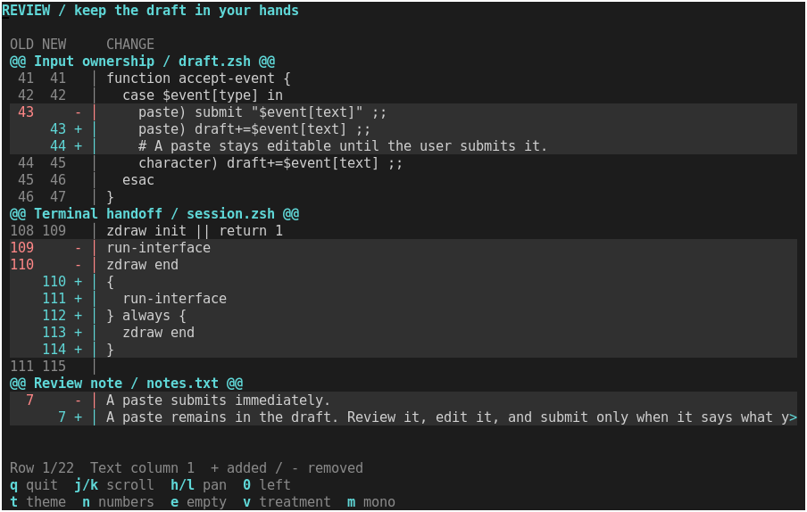

# Change gutters

Bounded design study requested by the maintainer, 2026-09-11: compact line
numbers and explicit added/removed markers for review text. The deliverable is
one experimental Zsh drawing function, a runnable example and terminal evidence.
It remains an example component for visual review.



The gutter makes row identity stable while the text moves. At ordinary widths
it shows old and new line numbers in separate columns. Below 60 available
columns it shows one number: the old number for a removal, the new number for
an addition or context row. `+` and `-` carry the meaning in every color profile.

Changed passages share a subtle surface color. The gutter carries the accent
or error color; body text retains its reading color. Hunk headings span the
view and remain visible horizontally. No extra spacer rows are inserted.

## Try it

After the [normal build](building.md), use the matching shell:

```sh
.build/zsh/Src/zsh -df examples/change-gutter.zsh
.build/zsh/Src/zsh -df examples/change-gutter.zsh --theme light
.build/zsh/Src/zsh -df examples/change-gutter.zsh --profile mono --ascii
```

| Key | Action |
| --- | --- |
| `j` / `k`, Up / Down | Scroll review rows |
| Page Up / Page Down, Home / End | Move by a viewport or to an endpoint |
| `h` / `l`, Left / Right | Pan text four columns; gutter remains fixed |
| `0` | Return to the leftmost text column |
| `n` | Toggle automatic or single-column line numbers |
| `t` | Switch dark/light theme |
| `v` | Toggle colored change text on the canvas; bold in monochrome |
| `e` | Toggle empty data |
| `m` | Toggle monochrome within terminal capabilities |
| `q` / Escape | Quit and restore terminal state |

The example displays fictional code and prose changes. It never reads project
files or applies changes. The profile option is a ceiling on detected color
capability; `NO_COLOR` selects monochrome initially.

## Reuse

The [component](../examples/components/change-gutter.zsh) only loads the existing
UI style helpers. Loading does not start a terminal session. Keep its location
relative to `lib/` when copying the prototype.

In an initialized session, with a sufficiently large window:

```zsh
source examples/components/change-gutter.zsh
typeset -A zdraw_ui_theme zdraw_ui_gutter
zdraw-ui-theme dark 256  # Use a profile supported by the terminal.
zdraw-change-gutter stdscr 2 1 12 78 1 -- \
  hunk    -  -  '@@ Release notes @@' \
  context 10 10 'Keep existing keyboard shortcuts.' \
  remove  11 -  'Submit pasted text immediately.' \
  add     -  11 'Keep pasted text editable.' || return
# Present after completing the application frame.
```

Arguments: window, row, column, height, width, first review row, options, `--`,
then `kind old-number new-number text` tuples. Review-row indices are one-based
and include hunk headings; they are separate from source line numbers.

| Kind | Old number | New number | Marker |
| --- | --- | --- | --- |
| `context` | Required | Required | Blank |
| `remove` | Required | `-` | `-` |
| `add` | `-` | Required | `+` |
| `hunk` | `-` | `-` | Heading across the view |

The application supplies classification and line numbers. This is a renderer,
not a diff parser, change calculator, patch editor or syntax highlighter.

Options are `numbers=auto|both|single`, `offset=0..32767` in terminal columns,
`glyphs=auto|ascii`, and existing color/emphasis utilities. Defaults are auto
numbers, zero offset and auto glyphs. Geometry utilities must remain at their
neutral defaults. Native drawing and the shared theme contract are unchanged.

`positive`, `negative` and `header` style tags correspond to additions,
removals and hunk headings. For example, `positive:fg=accent` colors addition
text as well as its gutter. The example's local variation also sets
`positive:bg=canvas negative:bg=canvas negative:fg=error`, exchanging shaded
passages for colored change text. In monochrome it uses bold instead. These
overrides do not alter the caller's theme or neighboring pieces.

The caller owns writable `zdraw_ui_gutter`. On success it reports:

| Field | Meaning |
| --- | --- |
| `first`, `offset` | Actual clamped review-row and horizontal positions |
| `count`, `visible` | Input row count and viewport capacity, excluding its header |
| `max_offset` | Last useful horizontal position for this data and width |
| `numbers` | Resolved `both` or `single` mode |
| `text_columns` | Text width after the gutter and clipping indicator |

Pass the desired first row and offset on each render. The function clears only
its assigned rectangle, preserves native cursor/current style and neither reads
input nor presents. It does not create another event loop or own selection.

Limits: 256 tuples, 65536 total text characters, positive source line numbers
of at most six digits, and at most 32767 measured columns per source line.
At least two rows and eight text columns after the gutter are required. The
gutter width follows the largest supplied line-number field, including offscreen
rows, so scrolling does not make columns jump.

Text uses existing native validation: controls and tabs must be normalized by
the caller. Printable literal text is never evaluated. The last column displays
`>` when text continues to the right. A horizontal boundary through a wide
character leaves a blank cell, preserving alignment and its combining sequence.
This uses native cell units, not terminal font shaping or full grapheme layout.

Invalid data/options return 1 before drawing or publishing output. Insufficient
space returns 2. Native errors propagate; a runtime drawing failure may leave
partial output. Empty input is valid and clears stale rows with “No changes”.

## Visual review and evidence


Also compare [light](change-gutter/light.png), [monochrome](change-gutter/mono.png),
[colored-text variation](change-gutter/variant.png) and [empty](change-gutter/empty.png).
These are actual xterm captures; the font, geometry, command options and
source/module hashes are recorded in [captures.json](change-gutter/captures.json).

The existing semantic document's code blocks provide a useful baseline for
reading text. This treatment adds explicit before/after row identity and keeps
that identity fixed during horizontal reading. It uses the same theme and native
cell primitives; it does not expand the document format or native C module.
Code and release-note prose use the same tuple contract without a component fork.

Tradeoffs remain visible: single-column numbering saves space but omits the old
number of context rows; long source lines need horizontal navigation; hunk
headings can clip on very narrow screens. The renderer cannot verify whether
the application's numbers or classifications correctly describe a real change.
No claim of superiority to other diff viewers or promotion to a supported
component family follows from this study.

Reproduce the captures with optional development tools Xvfb, xterm, xwininfo
and ImageMagick:

```sh
python3 scripts/capture-design-study.py --example change-gutter --output .build/change-gutter-captures
ZSH_BUILD_ROOT="$PWD/.build/sources/zsh-5.9.2" make test
python3 benchmarks/design-study.py --example change-gutter --output .build/change-gutter-timings.json
```

Tests cover fixed gutter alignment, local theme/style isolation, cursor/style
preservation, six-digit source numbers, compact mode, wide-character panning,
clipping, scroll clamping, empty input, rejection before drawing, live resize,
basic/monochrome/ASCII fallbacks and terminal cleanup.

Final validation: all **141 tests passed** using the selected Zsh 5.9.2 source
tree and matching built shell. An earlier run encountered a temporary build-file
copy race caused by overlapping a rebuild with the tests; the final run passed
after that overlap ended. No product-code change was needed for that test issue.

The complete example render measured 7.290 ms median (7.383 ms p95) at 120 × 32,
and 6.737 ms median (6.842 ms p95) while scrolling at 44 × 20. Each scenario used
three fresh processes, four warmup frames and twenty measured frames per process.
The wide case fits all 22 sample rows and measures redraw; the narrow case moves
the viewport. Timing includes the example's theme resolution and curses refresh,
but excludes snapshot capture, input waiting and emulator painting. It is not an
end-to-end latency or frame-rate guarantee. See [raw samples and provenance](change-gutter/timings.json).

Stop for visual review here. Shadows remain rejected; no further feature family
or old roadmap item is authorized by completion of this prototype.
