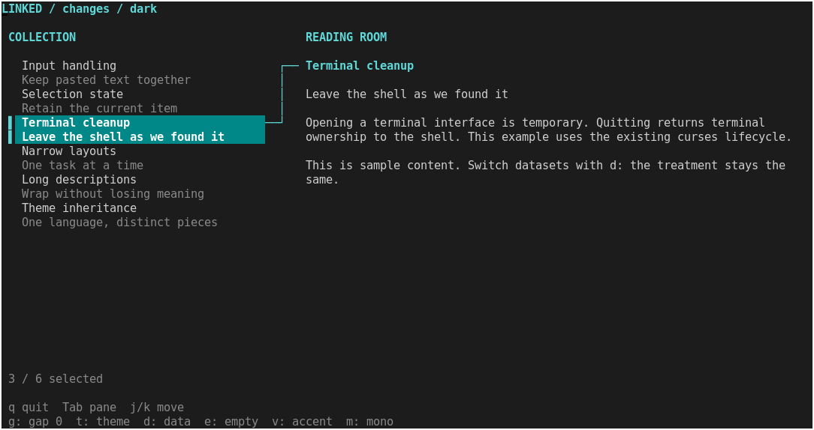
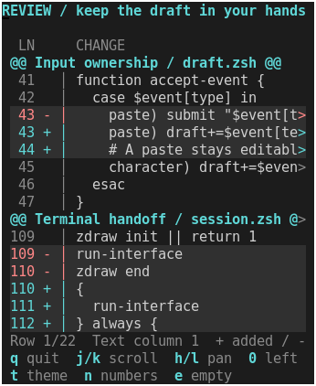
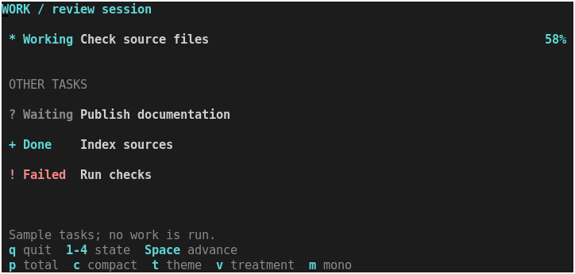

# Choose and combine TUI pieces

Start with the experience you want to give the reader. Choose an existing piece,
run its example, then replace the sample data and adjust the treatment. One
shared theme connects the pieces; your application decides what they mean and
how they respond to input.


The screen above combines three experimental treatments with no changes to
their implementations. Run it after the [normal build](building.md):

```sh
.build/zsh/Src/zsh -df examples/review-composition.zsh
```

Use `j`/`k` to select a file, Tab to focus the changes, and `h`/`l` to pan the
text. Press `t` for a shared theme change and `v` for a variation affecting only
the status display. The [composition recipe](recipes/review-composition.md)
explains the complete application and all controls.

## Choose by the job

| What the reader needs | Starting point | When to choose it |
| --- | --- | --- |
| Follow a selection into its details | [Linked detail](linked-detail.md) | Two-line summaries, a selection rail and a visible connection to another region |
| Read additions and removals | [Change gutter](change-gutter.md) | Caller-supplied before/after line numbers and markers that stay fixed while text pans |
| Understand what is happening | [Status strip](status-strip.md) | Working, waiting, done or failed; title, optional explanation and measured progress |
| Browse a conventional list and panel | [List/detail recipe](recipes/list-detail.md) | A starting layout using the ordinary library components |
| Compare records in columns | [Table inspector](recipes/table-inspector.md) | Table selection, column layout and scrolling |
| Edit several related values | [Inputs and forms](inputs-and-forms.md) | Input fields, validation and application-owned submission |
| Read structured text | [Semantic documents](semantic-documents.md) | Headings, paragraphs and code with wrapping and navigation |
| Add one small indication | [Labels, badges and meters](ui-presentation.md) | A label or number is enough; compose its surrounding context yourself |

The first three are **experimental example components** in
`examples/components/`. Their captures and tests support evaluation; they have
not been promoted to supported toolkit families. The other entries use the
existing libraries under `lib/`. The [library reference](ui-toolkit.md#select-what-to-load)
lists the individual loaders.

## Choose the treatment and its footprint

### Selection that leads somewhere



Use `zdraw-linked-detail` for a collection whose selected item deserves a second
region. Give it title/description pairs; draw your own content in its returned
detail rectangle. That content can be a document, status plus changes, or another
existing renderer that fits.

`item-gap=0` uses two rows per entry. `item-gap=1` adds one blank row. The
component needs at least 6 rows and 24 columns; it splits into two panes at 72
**allocated** columns. Below that it shows the focused pane. The application
chooses focus and handles the keys that move it.

Try the [catalog variation](linked-detail/catalog.png) to see different data and
a local treatment. [API and runnable example](linked-detail.md#reuse-the-piece).

### Change markers that preserve reading position



Use `zdraw-change-gutter` when the application already knows which rows are
added, removed or unchanged. `numbers=auto` uses old/new columns at 60 allocated
columns and a single number below that. `numbers=single` keeps the compact
treatment at wider sizes too.

The header takes one row. At least one content row and eight text columns after
the gutter are required; larger line numbers widen the gutter. Pass scroll
offsets explicitly and retain the adjusted offsets returned by the component.
The text can move horizontally while the numbers and `+`/`-` markers remain fixed.
[Data format and API](change-gutter.md#reuse).

### Status that earns its space



Use `zdraw-status-strip` for a state and subject that must be read together.
Allocate one row for the state, title and optional percentage; allocate two
when an explanation matters. A known total gets a meter on the second row at
60 allocated columns, or a percentage when narrower. Minimum width is 24.

Omit progress when the total is unknown. `waiting` and `failed` can show the last
reported value without implying that work continues. The function owns no
timer or task runner. Its height covers its own rows only: any surrounding gap
belongs to the application. [States, progress and API](status-strip.md#reuse).

## Establish one design language

Choose a supported color profile using `zdraw colorinfo`, then establish the
theme once for the composition. The examples show this setup, including initial
`NO_COLOR` handling. The theme resolver itself does not detect terminal support.

| Shared role | How the existing treatments interpret it |
| --- | --- |
| `canvas`, `text`, `muted` | Reading surface, primary text and secondary explanation |
| `selection`, `on-selection` | Selected list entry and its readable foreground |
| `accent` | Selection connector, addition markers and active status emphasis |
| `error` | Removal markers or a failed status, according to the component's task |

A shared role connects appearance, not application meaning: removing a review
line does not mean a task failed. Explicit markers and state words carry that
distinction even in monochrome.

Apply variation at the narrowest useful level:

| Desired change | Existing control |
| --- | --- |
| Restyle the whole composition | Reapply `zdraw-ui-theme` and redraw; preserve application state |
| Reduce linked-list spacing | Pass `item-gap=0` to that instance |
| Emphasize only the status word | Pass `key:reverse` to that status instance |
| Remove only the status title's bold | Pass `title:no-bold` to that status instance |
| Color added review text | Pass `positive:fg=accent` to that gutter instance |
| Keep review numbering compact | Pass `numbers=single` to that gutter instance |

These controls are deliberately different. The current theme contains colors;
it is not a global density or border preset. Applications can keep a few named
arrays of component options to reuse their own treatments. Pass arrays as quoted
entries, as the examples do, so each utility remains one argument.

Conditional utilities apply after unconditional utilities; within each pass,
the last matching value wins. Use the relevant state/part prefix to override a
component's conditional default. Reapplying a theme replaces earlier theme
overrides, so retain and reapply any custom palette deliberately. See the exact
[theme](ui-toolkit.md#themes) and [style precedence](ui-toolkit.md#utilities-and-states)
contracts before adding a new variation.

## Connect the pieces in application code

| Piece | Application supplies | Successful call updates |
| --- | --- | --- |
| Linked detail | Item pairs, focus, rectangle, `zdraw_ui_list` selection/viewport | Reconciled list state, `zdraw_ui_link` layout information and detail rectangle in `reply` |
| Change gutter | Classified rows, rectangle and requested offsets | `zdraw_ui_gutter`, including actual offsets and visible capacity |
| Status strip | Phase, title, detail, rectangle and optional value/total | No persistent component state or output association |

All three read the shared `zdraw_ui_theme`. Save `reply` immediately after the
linked component returns. Skip a hidden or empty detail rectangle. Choose the
status and review data from the reconciled selection, then render both into
separate parts of that rectangle. Present once after the complete frame is ready.

Start from the [review composition source](../examples/review-composition.zsh):

1. Replace its titles, summaries, phases, explanations and `review-data` rows.
2. Keep selection and scroll offsets in application state. If data can reorder,
   preserve selection by your own stable item identity.
3. Choose how much space belongs to each piece. Follow the returned rectangles
   and the minimum sizes in each component's contract.
4. Change the shared theme or pass local utilities at the drawing calls.
5. Keep the application's resize, error handling and `always` cleanup when
   replacing its key handling with your own policy.

Loading these components only defines functions. Drawing needs the native
module and an initialized session; input and presentation remain application
responsibilities. Keep experimental files in their existing relative directory
structure alongside `lib/`, including `lib/ui/`. Source only the public loaders
you need; their dependencies load with them. These examples introduce no new
external runtime programs. The native binary still needs a matching Zsh ABI,
as explained in [building and distribution](building.md#try-the-module).

## Evaluate your adaptation

Try realistic long labels, empty data, failure states, a narrow terminal, resize
and monochrome before judging the result. State words and markers should still
make sense without color. Check that the reader can reach clipped content and
that changing themes does not reset their position.

The linked manuals contain actual terminal captures, controls, limits and
verification evidence. The earlier [three-composition study](design-study.md)
offers additional layout ideas; none is a mandatory application template.
Use the existing [capture and replay tools](visual-regression.md) when your
adaptation needs repeatable visual checks.
