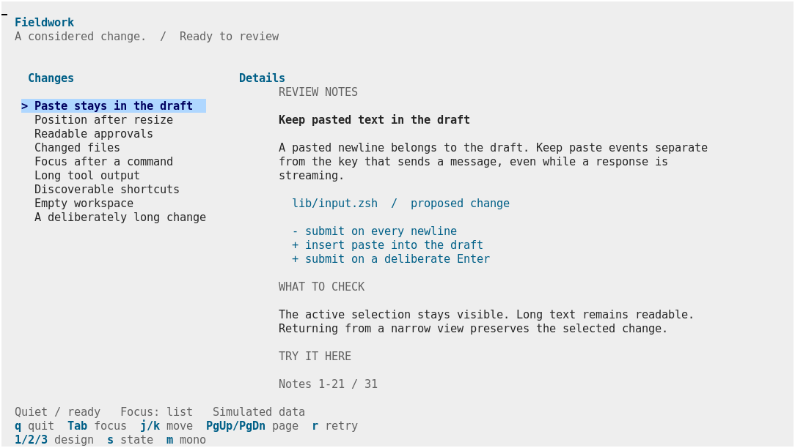
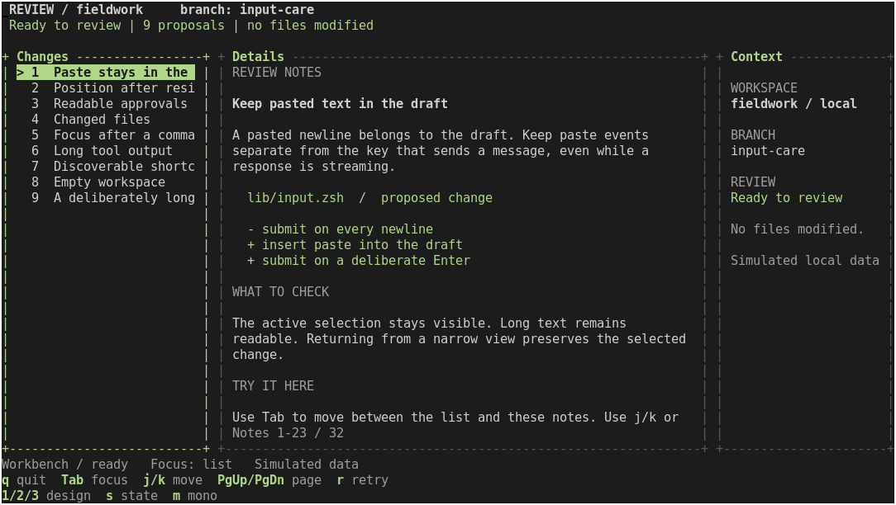
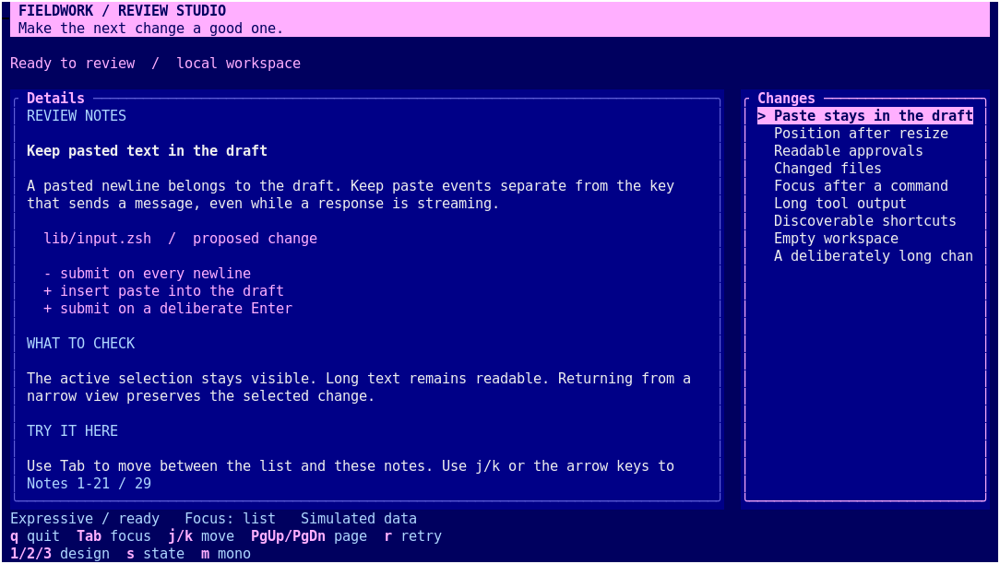

# One workspace, three visual directions

This is the first design study, recorded 2026-09-11. Its question is practical:
how different can complete, useful interfaces look when composed from the
existing zdraw toolkit? The subject is a fictional change-review workspace,
inspired by zcoder's list/detail workflow. It contains no agent integration,
network access or file mutations.

The runnable example shares its data, state transitions and input loop across
three compositions. There are no new native operations or toolkit APIs.

## Try the study

After the [normal build](building.md), run from the repository root:

```sh
.build/zsh/Src/zsh -df examples/design-study.zsh
```

Use the matching built shell. The example can also be launched by absolute path
from another directory. It needs only the module and its selected Zsh libraries
at runtime; the screenshot and timing tools are separate development tools.

| Key | Action |
| --- | --- |
| `1`, `2`, `3` | Quiet, workbench, expressive; retain the selection and focus |
| Tab or Enter | Move between change navigation and detail scrolling |
| `j`/`k`, Up/Down | Move the focused list or scroll the notes |
| Home/End, Page Up/Page Down | Move to an endpoint or travel by a viewport |
| `s` | Cycle ready, empty, busy and error states |
| `r` | Retry a simulated check |
| Space | Advance a busy check; two advances complete a fresh check |
| `m` | Toggle monochrome within the detected terminal profile |
| Escape | Return from detail to the list, then quit |
| `q` | Quit and restore the terminal |

Work is deliberately advanced by a key, with no background timer. You can
inspect a busy frame for as long as you need. The example never performs the
changes described in its content.

To start at a particular point:

```sh
.build/zsh/Src/zsh -df examples/design-study.zsh --design workbench --state busy
.build/zsh/Src/zsh -df examples/design-study.zsh --design expressive --profile 16 --ascii
NO_COLOR=1 .build/zsh/Src/zsh -df examples/design-study.zsh
```

`--profile 256` is a preference, not a capability override. The example uses
256 indexed colors only when the initialized terminal reports that profile;
it falls back to basic colors or monochrome. It does not enable truecolor or
terminal protocols. Font, font size and glyph appearance belong to the terminal.

## The designs

These are **actual xterm screenshots**, captured on a private Xvfb display at
120 columns by 32 rows, using DejaVu Sans Mono 11 and `xterm-256color`.
They are not image-generated mockups or HTML approximations. Exact capture
configuration and source/binary hashes are in
[captures.json](design-study/captures.json).

### Quiet workspace



A light neutral canvas, blue accent, borderless regions and a centered reading
column. Space and text weight provide the structure. Short navigation labels
keep the list scannable; the complete title is wrapped in the details.

At the 256-color profile, canvas/text/accent are `255/235/24`, with selection
`153`. This is a calm reading direction, not a requirement that all applications
use a light theme. Its tradeoff is lower information density and earlier
collapse to a single pane.

### Dense workbench



A dark neutral surface with a pale green accent, ASCII frames, compact spacing
and a third context pane when width permits. Context has a stable position and
can be scanned without leaving the notes. At 256 colors, canvas/text/accent are
`234/252/150`.

This fits inspection tasks better than long-form reading. The context pane
costs reading width, and some context repeats the header. That is a tradeoff to
evaluate with real users, not a reason to introduce another widget.

### Expressive console



A navy canvas, cobalt surfaces and a lilac title ribbon. The content leads on
the left, with navigation on the right. Rounded frames separate the surfaces;
the accent identifies selection and actions. At 256 colors, canvas/surface/
accent are `17/18/219`.

The title ribbon is the signature element. This has more personality and spends
more rows on identity. It still uses ordinary text cells and works with ASCII
borders and monochrome.

## Small screens and nonideal states

Below 82 columns for quiet, 78 for workbench and 80 for expressive, the focused
pane uses the available width. Tab/Enter switches panes. Below 32 columns or
12 rows, a compact resize/quit message replaces the layout. Selection survives
collapse and expansion; scroll offsets are clamped to the newly wrapped notes.
An exact source anchor through reflow is not implemented in this recipe.

| Situation | Captured example |
| --- | --- |
| Narrow detail view, 44x20 | [Quiet](design-study/quiet-narrow.png), [workbench](design-study/workbench-narrow.png), [expressive](design-study/expressive-narrow.png) |
| Empty list with a next action | [Quiet / empty](design-study/quiet-empty.png) |
| Busy check, progress and navigation remain visible | [Workbench / busy](design-study/workbench-busy.png) |
| Readable failure and explicit retry | [Expressive / error](design-study/expressive-error.png) |
| Selection without color, ASCII borders | [Expressive / monochrome](design-study/expressive-mono.png) |
| Basic terminal palette | [Workbench / 16 colors](design-study/workbench-16.png) |

## What authoring the study revealed

- **Composition already permits different visual identities.** Theme overrides,
  panel utilities, layout tracks and ordinary Zsh branching were sufficient.
  Changing native rendering would not have helped the initial design work.
- **The document helper makes prose noticeably better.** The first version
  used native `textwrap`, which deliberately preserves cells rather than words.
  A real screenshot exposed broken words. The existing document compiler supplies
  word wrapping; the example paints its semantic rows with public labels.
- **A short navigation label and a full title serve different needs.** Initially
  almost every list entry clipped. Explicit navigation labels made it readable
  without changing list rendering or losing the original title.
- **Terminal color profiles need visual review.** The first capture used basic
  `xterm` terminfo and did not exercise the intended palette. For basic colors,
  this example also disables selected-row bold because some terminals brighten
  black into gray. Monochrome retains the selection marker and reverse video.
- **Layout helps, but geometry still takes work.** The application owns pane
  collapse, optional context, content rectangles and footer allocation. The
  `study-line` helper bounds relative row placement. It is example-local, not a
  proposed abstraction that every application must adopt.
- **The comparison harness adds code.** The example combines six optional
  libraries, three compositions, four states, options and navigation. It is an
  exploration to read selectively, not the smallest starter. Start with
  [list/detail](recipes/list-detail.md) when copying your first application.

Inspect `study-theme` for visual tokens, `study-render` for composition,
`study-detail` for readable content and the final loop for application-owned
interaction. The rendering functions do not read keys or choose actions.

## Verification and measurements

The PTY tests run the actual example, inspect retained screen text, exercise
selection and detail scrolling, switch all designs, traverse the four states,
retry, shrink/grow the terminal and check terminal-mode restoration. They also
exercise forced basic/monochrome palettes and a `vt100` terminfo fallback.
The complete `make test` run passed **135 tests** with the matching public
Zsh 5.9.2 build on 2026-09-11. All eleven captured terminal states were visually
reviewed; that graphical review is separate from the PTY suite.

```sh
ZSH_BUILD_ROOT="$PWD/.build/sources/zsh-5.9.2" make test
python3 scripts/capture-design-study.py --output .build/design-study/captures
python3 benchmarks/design-study.py --output .build/design-study/timings.json
```

Graphical capture additionally needs Xvfb, xterm, xwininfo and ImageMagick's
`import`. It creates and closes its own display and windows. It never captures
the user's desktop. The standard tests and runtime do not require these tools.

The timing harness uses three fresh processes per design and size, four warmup
frames and twenty measured frames. Wide runs alternate selection; narrow runs
alternate detail scrolling. Timing covers a complete Zsh redraw through curses
refresh, including the instrumentation wrapper. Snapshot serialization, input
waiting and graphical emulator painting are outside the timed region. Native
call counts describe calls routed through that wrapper, not C-only work.

Recorded results and their practical interpretation appear in the companion
[measurement record](design-study/measurements.md). These examples redraw and
recompile their small document on each change. They establish neither a maximum
frame rate nor performance for a large streaming transcript.

## Decision after the first study

Keep these as three directions to evaluate, not three new mandatory themes.
The existing primitives are sufficient for this comparison. More useful next
evidence would come from trying one direction on a representative zcoder view
and observing developers adapting a recipe. No additional C feature, automatic
roadmap progression or broad application framework is authorized by this study.
