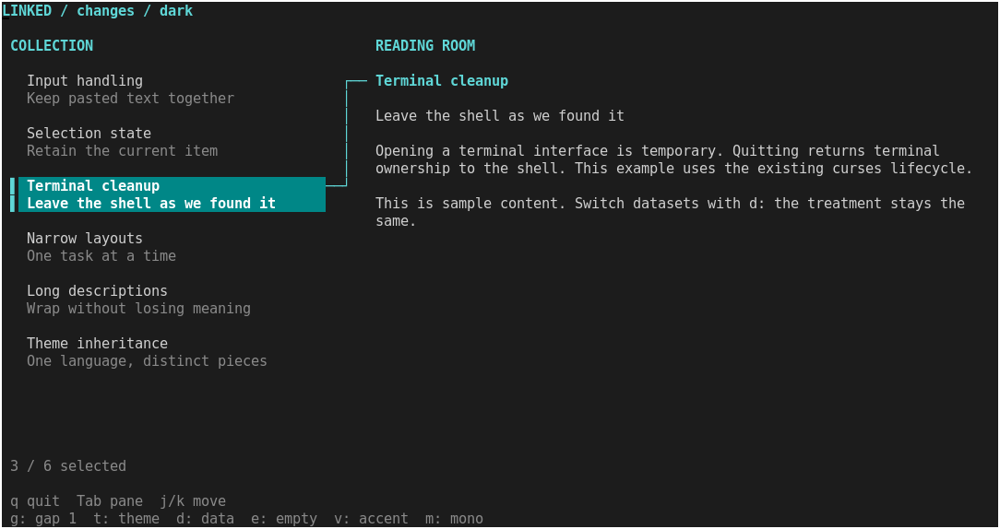
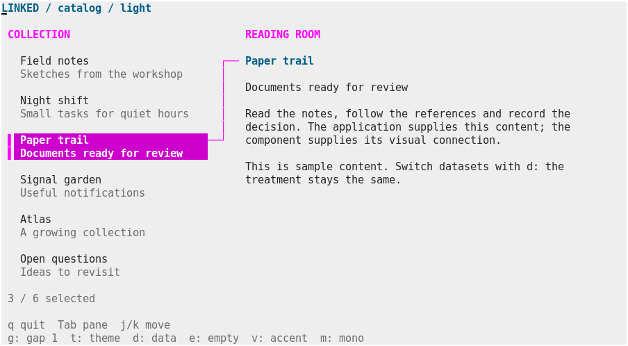

# Linked list and detail treatment

Bounded design prototype, 2026-09-11. Task: help a reader follow a selected item
from a short list summary into its complete explanation. Stopping point: one
reusable Zsh drawing function, a runnable example, terminal captures and tests.
This is an experimental example component, not a new supported toolkit family.

The treatment uses two-line entries, a selection rail and a connecting line.
Below 72 available columns, it shows the focused pane. The application renders
the detail content using the existing document component.



## Run it

After the [normal build](building.md), use the matching built shell:

```sh
.build/zsh/Src/zsh -df examples/linked-detail.zsh
.build/zsh/Src/zsh -df examples/linked-detail.zsh --item-gap 0
.build/zsh/Src/zsh -df examples/linked-detail.zsh --theme light --dataset catalog --variant
.build/zsh/Src/zsh -df examples/linked-detail.zsh --profile mono --ascii
```

| Key | Action |
| --- | --- |
| Tab / Enter | Switch the focused pane |
| `j` / `k`, Up / Down | Select an item or scroll its details |
| Home / End, Page Up / Page Down | Navigate the focused pane |
| Escape | Return focus to the list |
| `t` | Switch dark/light theme |
| `d` | Switch sample change review/catalog data |
| `e` | Toggle an empty collection |
| `v` | Toggle a local accent override |
| `m` | Toggle monochrome within terminal capabilities |
| `g` | Toggle zero/one blank row between entries |
| `q` | Quit and restore terminal state |

Profiles are ceilings on the terminal's detected color capability. `NO_COLOR`
selects monochrome initially. `--ascii` affects decorations, not application
text. The example needs no external runtime programs beyond Zsh and zdraw's
existing curses dependencies.

## Reuse the piece

The [component](../examples/components/linked-detail.zsh) loads the existing
list and layout helpers passively. Keep its location relative to `lib/` when
copying this prototype. It does not start a session, read input or present a frame.

Inside an initialized zdraw session, with an existing window large enough:

```zsh
source examples/components/linked-detail.zsh
typeset -A zdraw_ui_theme zdraw_ui_list zdraw_ui_link
typeset -a reply detail_rect
zdraw-ui-theme dark 256  # Select a profile supported by this terminal.
zdraw_ui_list=(selected 1 first 1)

zdraw-linked-detail stdscr 2 1 20 98 list \
  list-title=COLLECTION detail-title=DETAILS -- \
  'Field notes' 'Sketches from the workshop' \
  'Paper trail' 'Documents ready for review' || return
detail_rect=("${reply[@]}")
# Draw the selected item's content in detail_rect when its height is nonzero.
# Present after completing the whole frame; handle input in the application.
```

Contract:

- Arguments: window, row, column, height, width, `list|detail` focus, options,
  `--`, then title/description pairs. Zero pairs is a valid empty collection.
- Options: `list-title=`, `detail-title=`, `glyphs=auto|ascii`, `item-gap=0|1`
  and existing color/emphasis style utilities. Defaults are Items, Details,
  auto glyphs and one gap row. Padding, borders and alignment are not
  customization points. The former shadow/depth options are rejected.
- Limits: at least 24 columns and 6 rows; at most 128 pairs and 262144 total
  title/description/header characters, within the toolkit's rectangle limit.
  Single-line inputs use native text validation and cell clipping.
- Caller owns writable `zdraw_ui_list`, `zdraw_ui_link` associations and `reply`
  array. Shared `zdraw_ui_theme` is read-only to the component.
- The function reconciles `zdraw_ui_list`'s `selected` and `first` entries with
  the count and viewport using `zdraw-list-update`. Call that same helper for navigation.
- `reply` returns detail row/column/height/width. In the narrow list view it is
  `0 0 0 0`. `zdraw_ui_link` reports `mode` (`single|split`), `visible` list
  capacity and absolute `selected_row` (`-1` when no selected row is drawn).
- The function clears and draws only its assigned rectangle. Native cursor
  and current drawing style are preserved. Application data, focus, detail
  rendering, scrolling, input and terminal lifecycle remain application-owned.
- Bad arguments and styles are rejected before drawing or publishing state.
  Too-small rectangles return 2; invalid input returns 1. Native runtime errors
  propagate and can leave partial drawing. There is no whole-component rollback.

The theme supplies canvas, text, muted, accent, selection, inactive selection
and border colors. For example, `header:fg=5 selected:bg=5 selected:fg=7`
changes one call's accent and selected tile using existing indexed colors.
The theme and adjacent document component retain their own styles. In the
example, this variation uses underline instead of color overrides in monochrome.



Both datasets go through the same function. Reuse required data replacement,
three style overrides and the same existing document renderer; it required no
component fork, C changes or knowledge of zcoder's application model.

## Shadow experiment rejected

Maintainer decision, 2026-09-11: disable shadows. Neither the initial full-cell
stipple nor the thinner and adjustable variants met the visual quality bar.
The maintainer would not use these results in an application. Passing tests
and offering more settings do not make the treatment worth keeping.

Shadow drawing, API options and example controls have been removed. Do not
restart incremental tuning of these variants. Reconsider only if a bounded
experiment demonstrates a substantially different technique with a visibly
excellent result in an actual terminal, acceptable space and runtime costs,
and dependable fallbacks. Seek maintainer review before restoring it. This is
not an automatic research task or a deferred roadmap item.

The independent spacing control remains: `item-gap=0` uses two rows per entry;
`item-gap=1` adds a blank row. Both preserve selection and reconcile the viewport.


## Evidence and limits

Captures are actual xterm frames on a private Xvfb display. See
[capture provenance](linked-detail/captures.json), including example, component
and module hashes. Additional captures show [light](linked-detail/light.png),
[narrow list](linked-detail/narrow-list.png),
[narrow details](linked-detail/narrow-detail.png),
[empty](linked-detail/empty.png) and [monochrome](linked-detail/mono.png).

Reproduce with optional development tools Xvfb, xterm, xwininfo and ImageMagick:

```sh
python3 scripts/capture-design-study.py --example linked-detail --output .build/linked-detail-captures
ZSH_BUILD_ROOT="$PWD/.build/sources/zsh-5.9.2" make test
```

PTY tests cover theme and local override isolation, selection/viewport updates,
nonzero rectangle origins, cursor/style preservation, malformed-input rejection
without drawing, resize through a tiny terminal, detail scrolling, empty data,
ASCII/basic-color/monochrome fallbacks, compact spacing, rejection of the former
shadow options without drawing, and cleanup. An unavailable requested
color profile falls back to the detected profile.

Validation: `make test` passed all 138 tests using the selected Zsh 5.9.2 source
tree and matching built shell after removing shadow drawing and controls.

A small producer-side redraw check recorded these results:

| Frame | Median | 95th percentile |
| --- | --- | --- |
| 120 × 32, flat selection | 10.105 ms | 11.338 ms |
| 44 × 20, detail scrolling | 9.831 ms | 12.637 ms |

Each scenario uses three fresh processes, four warmup frames and twenty measured
frames per process. Timing spans the complete example render through curses
refresh, including theme resolution and document compilation. It excludes
snapshot capture, input waiting and emulator painting. These numbers are not
an end-to-end latency or frame-rate guarantee. Raw samples and
source/module hashes are in [timings.json](linked-detail/timings.json).

```sh
python3 benchmarks/design-study.py --example linked-detail --output .build/linked-detail-timings.json
```

Remaining tradeoffs:

- Two-line entries use two rows plus the developer-selected zero/one gap row.
- The connector makes correspondence explicit, but becomes long when the
  selected row is near the bottom. It consumes a six-column gutter.
- List summaries clip at cell boundaries; complete explanations belong in the
  application's wrapped detail view. Narrow mode needs a pane switch.
- The example recompiles its small document on repaint. No acceleration or
  caching subsystem is justified by this design exercise alone.
- No busy state, worker, asynchronous loader or application integration is
  introduced. Empty and selected states are the component's relevant cases.
- These captures establish appearance in one emulator/font configuration.
  This is not evidence of superiority to other TUI toolkits or completion of
  the [quality bar for supported additions](scope.md).

Stop here for review of the piece's usefulness and appearance. Do not turn its
options into a framework or automatically start another component family.
