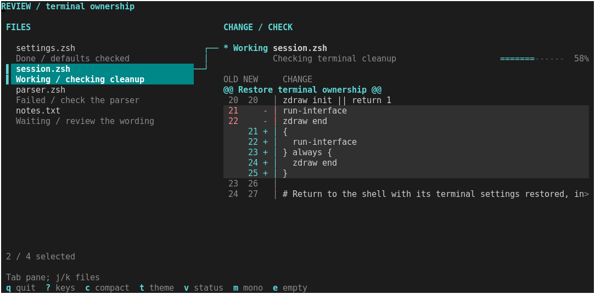
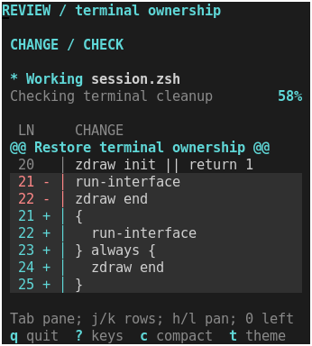

# Compose a review screen from existing treatments

The [runnable example](../../examples/review-composition.zsh) combines the
experimental linked-detail, status-strip and change-gutter components. It tests
the design direction's central promise: choose separate pieces, give them one
theme, and keep application state and interaction under your control.



The selected file connects directly to its check status, followed by the review
rows. Status stays in place while the changes scroll. A single theme change
restyles the selection, status and gutter; a local status override leaves the
other treatments alone.

This is an adoption example using existing interfaces. It adds no component API
and does not promote the experimental treatments to a supported component family.
The files and check results are fictional. No repository is read, no checks run,
and no changes are applied.

## Run and explore

After the [normal build](../building.md), from the repository root:

```sh
.build/zsh/Src/zsh -df examples/review-composition.zsh
.build/zsh/Src/zsh -df examples/review-composition.zsh --theme light
.build/zsh/Src/zsh -df examples/review-composition.zsh --compact
.build/zsh/Src/zsh -df examples/review-composition.zsh --keys
.build/zsh/Src/zsh -df examples/review-composition.zsh --profile mono --ascii
```

| Input | Behavior |
| --- | --- |
| Tab | Switch focus between the file list and changes |
| `j` / `k`, Down / Up | Select a file when the list has focus; scroll rows when changes have focus |
| `h` / `l` | Pan review text when changes have focus; line numbers remain fixed |
| `0` | Reset horizontal offset |
| `t` | Switch the shared dark/light theme |
| `v` | Emphasize only the status word locally |
| `c` | Toggle compact status; short terminals keep it compact automatically |
| `m` | Toggle monochrome within terminal capabilities |
| `e` | Toggle empty sample data; restoring selects the first file |
| `q` / Escape | Quit and restore terminal state |
| `?` | Open the complete key reference |

In the key reference, `j`/`k` or Up/Down scroll the keys, `?` or Escape returns
to the review, and `q` quits. Other review controls are ignored there. The
reference retains the review's selection, focus, styling and offsets; when you
return after resizing, normal viewport clamping still applies. `--keys` starts
with the reference open.

Selecting another file resets its review offsets. Switching focus, theme or
local styling preserves selection and offsets. Resize preserves them subject to
the components' viewport clamping. Density changes also retain the current row
and horizontal offset where they fit; expanding the visible review area can
clamp the first row near the end of the data. The example uses four fixed phases to show
working, waiting, done and failed states. The waiting sample has no total, so
it displays no invented percentage.

## The composition boundary

Load the three components and establish their existing caller-owned outputs:

```zsh
source examples/components/linked-detail.zsh
source examples/components/change-gutter.zsh
source examples/components/status-strip.zsh
typeset -A zdraw_ui_theme zdraw_ui_list zdraw_ui_link zdraw_ui_gutter
typeset -a reply body
```

In the application's render function, establish the theme once, call the linked
list, and save its returned detail rectangle immediately. Then divide that
rectangle between the status and gutter:

```zsh
# Within an initialized session; items and records are caller-owned arrays.
zdraw-ui-theme "$theme_name" "$profile" || return
zdraw-linked-detail stdscr 2 1 "$((rows-5))" "$((columns-2))" "$focus" \
  item-gap=0 -- "${items[@]}" || return
body=("${reply[@]}")

status_height=2 status_gap=1
(( compact || rows<18 )) && { status_height=1; status_gap=0; }
if (( body[3]>=status_height+status_gap+2 && body[4]>=24 && zdraw_ui_list[selected] )); then
  # Choose title, detail, phase and records for the reconciled selection here.
  zdraw-status-strip stdscr "$body[1]" "$body[2]" "$status_height" "$body[4]" \
    "$phase" "$title" "$detail" || return
  zdraw-change-gutter stdscr "$((body[1]+status_height+status_gap))" "$body[2]" \
    "$((body[3]-status_height-status_gap))" "$body[4]" "$first" "offset=$offset" \
    -- "${records[@]}" || return
  first=$zdraw_ui_gutter[first] offset=$zdraw_ui_gutter[offset]
fi
# Draw other application content, then present the completed frame once.
zdraw refresh stdscr
```

The default uses two status rows, one separating row and the remaining space
for the gutter. `--compact` or `c` selects one status row with no separating row,
giving the gutter two more visible content rows. The explanation is omitted and
known progress becomes a percentage. Below 18 terminal rows the example uses
this compact layout automatically; growing again restores the chosen preference.

At 74 terminal columns the linked component can show both panes;
below that it returns only the focused pane. Its hidden detail rectangle has
zero area, so the application skips both detail components. Below 11 rows or
26 columns the example shows a resize/quit hint instead.

The components know nothing about sibling components. The application's file
selection chooses both the status data and review rows. Only the application
reads events, clears the overall canvas, presents frames and ends the session.
Each component uses the same theme association and its own existing state or
output contract.

## What adoption exposed

- No component implementation changes were needed to combine the three pieces.
- The returned `reply` rectangle must be saved before another helper can replace
  it. Explicit local arrays make that dependency visible.
- A gutter can clamp its requested offsets. Copying its outputs back to the
  application keeps subsequent navigation consistent with what is on screen.
- Sharing a theme does not assign keyboard focus or propagate application data.
  Those connections remain a short, explicit part of the example.
- Breakpoints and reserved rows are application choices constrained by component
  minimum sizes. Switching the existing status height and the application's gap
  is enough to reclaim two rows; no new density API is needed.
- The linked component supplies the connector and two-line file entries. The
  composition adds no new frame, shadow or decoration.

The example repeats the established session/input boilerplate from the smaller
studies. That makes it independently runnable; this exercise does not justify a
new application framework. Long text still clips or scrolls, and footer hints
can omit trailing options on narrow terminals. The footer puts `? keys` beside
quit so the full reference remains discoverable at the example's minimum width.
It uses existing help rows, with one key/description pair per row and its own
scroll position. It needs no modal component or changes to the libraries.

## Visual and interaction evidence



Compare [compact at the same width and height](../review-composition/compact.png),
[11-row terminal](../review-composition/short.png),
[light](../review-composition/light.png),
[complete key reference](../review-composition/keys.png),
[narrow key reference](../review-composition/keys-narrow.png),
[narrow file list](../review-composition/narrow-list.png),
[monochrome](../review-composition/mono.png),
[local status emphasis](../review-composition/variant.png) and
[empty data](../review-composition/empty.png).
All eleven are actual xterm captures. Font, options, dimensions and hashes for
the example, all three components and module are recorded in
[captures.json](../review-composition/captures.json).

```sh
python3 scripts/capture-design-study.py --example review-composition --output .build/review-composition-captures
ZSH_BUILD_ROOT="$PWD/.build/sources/zsh-5.9.2" make test
```

PTY checks exercise file/status/content correspondence, unknown totals, focus,
scrolling, horizontal panning, local styling, theme changes, density and its
two-row gain, automatic compact layout, narrow/tiny resize,
empty-data clearing, basic/monochrome fallback and terminal restoration.
The key-reference checks also cover reaching every shortcut at minimum review
size, input isolation, return to the same reading position, tiny resize and
quitting directly from the reference with terminal settings restored.
The full suite passed all 149 tests against the locally built Zsh 5.9.2 shell
and matching module after the key-reference change.

This demonstrates reuse and records the required application glue. It makes no
new performance or comparative visual-quality claim. Stop here for review of
the composition; another feature family is not implied.
