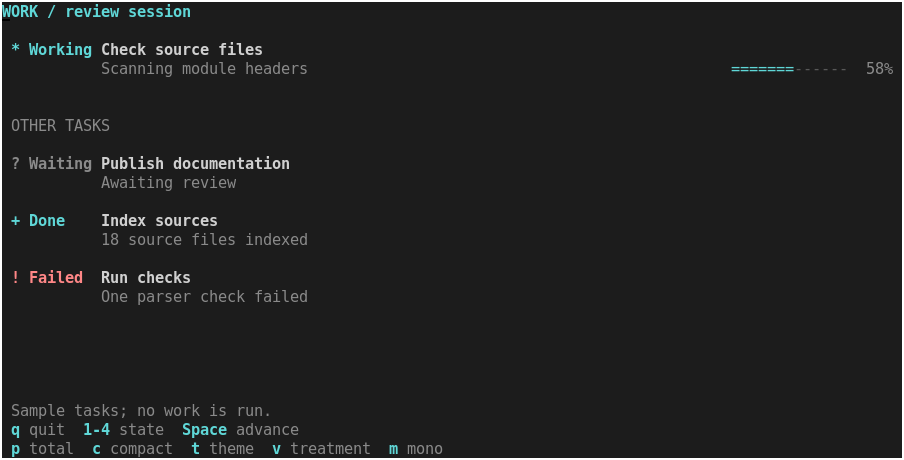
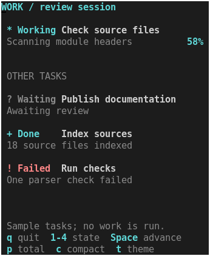

# Compact activity and status display

Bounded design study selected by the maintainer, 2026-09-11, after the initial
design studies were pushed. Task: show what is working, waiting, completed or
failed in a small, reusable region. This is an experimental example component
using the existing style and meter helpers.



The state word comes first and always fits. The task title follows, with an
optional second row for explanation. When a total is supplied, a compact meter
or percentage shows reported progress. Without a total, there is no invented
percentage, estimated completion time or pretend motion.

## Try it

After the [normal build](building.md), use the matching shell:

```sh
.build/zsh/Src/zsh -df examples/status-strip.zsh
.build/zsh/Src/zsh -df examples/status-strip.zsh --unknown
.build/zsh/Src/zsh -df examples/status-strip.zsh --compact --theme light
.build/zsh/Src/zsh -df examples/status-strip.zsh --phase failed
```

| Key | Action |
| --- | --- |
| `1` / `2` / `3` / `4` | Working / waiting / done / failed for the first instance |
| Space | Advance simulated working progress; waiting and failed stay stopped |
| `p` | Toggle whether the application's total is known |
| `c` | Toggle one/two-row layout, subject to available height |
| `t` | Switch dark/light theme |
| `v` | Toggle a local status emphasis treatment on the first instance |
| `m` | Toggle monochrome within terminal capabilities |
| `q` / Escape | Quit and restore terminal state |

All tasks are samples. The example runs no work and changes progress only in
response to its keys. The other three instances demonstrate reuse and isolated
styling. A shorter terminal uses one row per instance; below the demo's minimum
size it shows a resize hint. Color preferences cannot exceed detected capability.
`NO_COLOR` selects monochrome initially. All decoration uses ASCII characters.

## Reuse

The [component](../examples/components/status-strip.zsh) loads the existing meter
and style helpers passively. Keep its location relative to `lib/` when copying
this prototype. Inside an initialized session with a sufficiently large window:

```zsh
source examples/components/status-strip.zsh
typeset -A zdraw_ui_theme
zdraw-ui-theme dark 256  # Select a profile supported by this terminal.

zdraw-status-strip stdscr 2 1 2 78 working \
  'Check source files' 'Scanning module headers' value=7 total=12 || return

zdraw-status-strip stdscr 5 1 1 78 waiting \
  'Publish documentation' 'Awaiting review' || return
# Present once the whole application frame is ready.
```

Arguments: window, row, column, height, width, phase, title, detail, followed by
optional `value=N total=N` and ordinary color/emphasis utilities.

| Phase | Visible state | Existing style state |
| --- | --- | --- |
| `working` | `* Working` | `focus` |
| `waiting` | `? Waiting` | `inactive` |
| `done` | `+ Done` | `positive` |
| `failed` | `! Failed` | `invalid` |

Height must be one or two rows; width must be at least 24 columns. The title
clips after the fixed ten-column state area. In one row, the detail is omitted
and space is reserved for a percentage only if the caller supplies a total.

With two rows, details normally align beneath the title. Below 48 columns they
start at the left edge to recover room for the explanation. A known total gets
an 18-column meter at widths of 60 or more, otherwise a percentage. The component
uses exactly its allocated rows; the example's spacing belongs to its layout.

Both value and total must be supplied together, as integers from 0 to 32767,
with total positive and value no greater than total. The percentage is rounded
down. Missing progress means unknown, even for `done`; that state alone does
not manufacture `100%`. For waiting or failed work, supplied values are the last
reported progress, not a promise that work is advancing. Application code owns
the accuracy and consistency of phase, progress and explanation.

Style parts use the existing vocabulary: `key` for the marker/state word and
compact percentage, `title` for the task name, `label` for detail/meter label, and `filled`/`track`
for the meter. For example, `key:reverse title:no-bold` emphasizes one instance's
state without changing its shared theme. Failure defaults to the error color,
waiting to muted text, and working/completion to the accent color. The words
and markers preserve meaning when colors disappear.

At most 64 caller utilities are accepted. Borders, padding and alignment must
remain at their neutral defaults. Each text field is limited to 32767 characters
and uses native text validation; hidden detail is validated too. Invalid input
returns 1 before drawing; unsupported rectangle sizes return 2. Native errors
propagate and may leave partial drawing after a runtime failure.

The function clears its rectangle and preserves the native cursor/current
style, caller theme, `zdraw_ui_style` and `reply`. It owns no persistent state,
timer, input handler, task runner, progress counter or refresh. Updates and
presentation remain application-owned. The existing optional motion library
is independent; this study introduces no animation or protocol.

## Visual review and evidence



Compare [compact](status-strip/compact.png), [light](status-strip/light.png),
[unknown total](status-strip/unknown.png), [failed](status-strip/failed.png),
[monochrome](status-strip/mono.png) and [local emphasis](status-strip/variant.png).
These are actual xterm captures, with options, font and source/module hashes in
[captures.json](status-strip/captures.json).

The existing task-monitor recipe demonstrates badges, meters and activity
indicators in a larger interface. This treatment packages the smaller recurring
problem of state, subject, explanation and optional progress into one call.
It is still a restrained text treatment, not a claim to exceed other toolkits
or approval of a supported component family.

Tradeoffs: long titles clip, a one-row display omits explanations, and wide
layouts can leave substantial space between the detail and its right-aligned
meter. Applications choose a suitable rectangle and can show full details
elsewhere. The component does not infer actions or assign keys from its text.

Reproduce captures with optional development tools Xvfb, xterm, xwininfo and
ImageMagick, and run the normal checks with the selected Zsh source tree:

```sh
python3 scripts/capture-design-study.py --example status-strip --output .build/status-strip-captures
ZSH_BUILD_ROOT="$PWD/.build/sources/zsh-5.9.2" make test
python3 benchmarks/design-study.py --example status-strip --output .build/status-strip-timings.json
```

Tests cover all four state words, known/unknown totals, stopping behavior in
the example, local style isolation, cursor/style preservation, invalid input
without drawing, minimum width, hidden-detail validation, resize, basic and
monochrome fallback, and terminal cleanup.

The full suite passed: 144 tests against the locally built Zsh 5.9.2 shell and
matching module. The earlier design-study, linked-detail and change-gutter
benchmark paths also passed a short compatibility run.

Measured status/progress updates redraw the complete example, including all
four instances. Three fresh processes per size each supplied 20 measured frames
after four warmup frames:

| Terminal | Median | p95 |
| --- | --- | --- |
| 120 × 32 | 20.093 ms | 22.205 ms |
| 44 × 20 | 18.262 ms | 20.103 ms |

These are producer-side render and refresh timings on the recorded machine;
they exclude input wait, screen readback and emulator painting. They are not
end-to-end latency or a portable performance guarantee. Raw samples and source
hashes are in [timings.json](status-strip/timings.json).

Stop for visual review here. Shadows remain rejected, and no further design
candidate is automatically authorized by this study.
